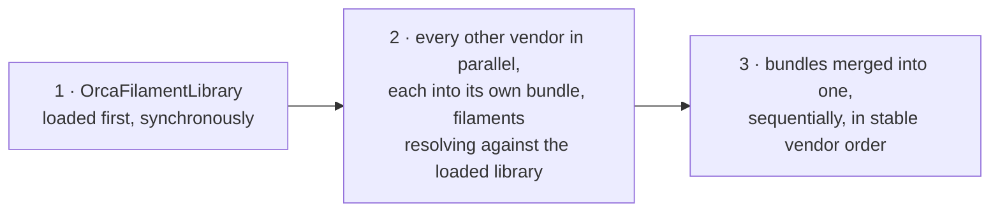
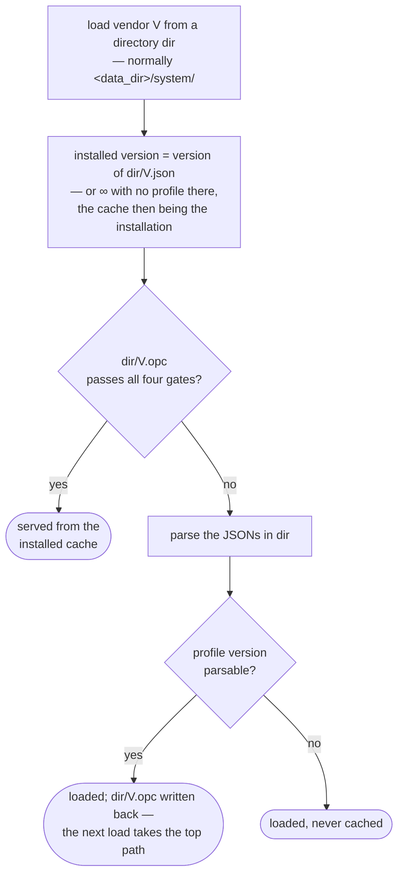

# System Preset Cache — High Level Design

## Why it exists

OrcaSlicer ships tens of thousands of system preset JSON files. Every launch used to
parse all of them: read each vendor profile, walk its machine, process and filament
sub-files, resolve inheritance, and build the preset collections from scratch. That
parse dominated startup, and it produced the same result every time, because system
presets only change when the app is updated or a profile update is installed.

The preset cache replaces that parse with a read. Each vendor's presets are serialized
once — at build time, in CI — into a single binary file the app reads in one pass. The
read replaces the file walk and the JSON parsing, which is where the time went;
resolving inheritance and registering the presets still runs at load, through the same
code the JSON path uses, so the result is the parse's result without the parse.

The cache is **only ever an optimization**. Every rule below exists to guarantee that a
cache is either provably equivalent to parsing the JSONs, or rejected. There is no
"mostly right" cache.

## The unit is one vendor

A cache covers exactly one vendor. `BBL.opc` sits beside `BBL.json` and holds
everything `BBL.json` and the `BBL/` sub-file tree would have produced.

Per-vendor granularity is what makes the system practical:

- A vendor whose profile is bumped invalidates only its own cache. The other 60-odd
  vendors keep theirs — even when the bumped vendor is the shared Orca filament
  library everyone else inherits from.
- The setup wizard, which loads vendors one at a time, gets the same speedup as
  startup without a second code path.
- A vendor with no cache, or a broken one, costs only that vendor a parse.

A cache holds *system* presets only. User presets, project settings and modified
presets are never serialized — they have their own storage and their own lifecycle.

## Where the files live

| Location | Contents on a shipped build | Role |
|---|---|---|
| `resources/profiles/` | `<vendor>.opc` alone — the profile and its preset JSONs both pruned | What the app ships with; what installing copies from, and the only thing it is read for |
| `<data_dir>/system/` | `<vendor>.opc` alone, or `<vendor>.json` + `<vendor>/` after an update | What the user has installed |
| `<data_dir>/system/` (dev build) | `<vendor>.json` + `<vendor>/` + `<vendor>.opc` written at runtime | A developer tree caches as it parses |
| `<data_dir>/cache/wizard_profile_data.json` | The wizard's derived vendor catalog plus the stamps it was built from | Written and read by the setup wizard only; never shipped (see "The wizard's profile-data cache") |

Two forms of the same vendor therefore exist, and the system's central rule is that
**a vendor's cache is the whole of it**. Where a cache ships or is installed, no profile
and no preset JSONs sit beside it: the cache carries the presets, the vendor profile,
and the version stamp that says which release it came from. A vendor is "installed" if
either form is present *and usable*, and its installed version is read from whichever
form a load would serve.

What stays beside the caches in `resources/profiles/` is everything that is not a
preset: each vendor's directory of printer thumbnails, cover images, bed models and
hotend meshes, which are read from disk by path and were never part of the cache. Files
that are not vendors at all, `blacklist.json` chief among them, are untouched.

The alternative — shipping both and treating the cache as a sidecar — was rejected. It
doubles the installed size, and it creates a class of bug where the two disagree and
the app's behavior depends on which one a given code path happened to read.

## What a cache file is

A fixed-size header followed by one binary stream.

The header carries a magic number, the cache format version, the payload size and a
CRC32 of the payload. It exists so that a truncated download, a half-written file or a
file from an entirely different program is rejected in microseconds, before anything
tries to interpret it.

The payload opens with the stamps that decide whether the cache may be used at all —
format version, vendor name, vendor version — then a dictionary, and then the vendor's
data: its vendor profile, three lists of preset entries (process, filament, machine),
and the count of errors the original parse hit.

Each entry is one preset **in source form**: what its JSON sub-file states and nothing
that resolving it derives — the preset's own config diff, the name of the preset it
inherits, and the parse metadata (name, sub-path, description, instantiation, setting
and filament ids, renames). Non-instantiated base presets are stored too; the children
that inherit from them cannot resolve without them.

**The payload names its own keys.** The dictionary holds the distinct `opt_key`s the
file uses, the `ConfigOptionType` each was written as, and the distinct enum *value
names*; an option in an entry's config is then a `uint16` index into that dictionary
plus its value. Names are written once per file rather than once per occurrence, and a
reader resolves the dictionary against this build's `print_config_def` once, after
which reading an option is a vector index.

This is what makes the cache survive config-schema drift. The alternative — keying an
option by its `serialization_key_ordinal`, the position `ConfigDef::add` assigns by
declaration order at static init — cannot: inserting one option into the middle of
`PrintConfig.cpp` shifts every later ordinal, and the lookup on the way back in then
*succeeds on the wrong option*, silently, wherever the two share a type. Because a
name-keyed payload instead drops the individual options this build cannot place, the
file as a whole stays readable, and there is no schema fingerprint — no checksum over
the option schema that would reject every cache on every release. An option this build
no longer defines, or now defines with a different type, gets exactly what it gets from
a JSON profile: read, dropped, and the rest of the preset loads.

The ordinal-keyed cereal hooks in `PrintConfig.hpp` are untouched — they are also the
undo/redo wire format, where the process cannot change underneath them. The cache has
its own serialization in `PresetCacheFormat.{hpp,cpp}`.

Three deliberate choices in the layout:

- **Stamps come first**, so the question "what version is this vendor installed at?"
  can be answered by reading the first kilobyte. The updater asks that question for
  every vendor on every launch; reading tens of megabytes to answer it would give back
  the startup time the cache saved. The dictionary sits behind them, ahead of the
  entries, so a reader that does go on resolves it once and then indexes.
- **Nothing inherited is baked in.** A filament preset that inherits from the shared
  library is stored as its own diff plus its parent's name, and the parent is looked up
  when the entry is installed, against whatever library is loaded then. A cache
  therefore carries no other vendor's values, and no other vendor's update — the
  library's included — can make it stale.
- **Nothing derived is stored.** Default presets, flattened configs, aliases and
  lookup maps are all reconstructed at load by the same code the JSON path runs, and
  state that path never fills (obsolete-preset lists) is not stored either. This keeps
  the cache a record of the vendor's data, not a memory image of the program's state.

## When a cache may be used

A cache is accepted only if every gate below passes. Any failure means "parse the
JSONs instead" — never a hard error, never a partial load.

**1. Integrity.** Magic number, a declared body size that is exactly the rest of the
file, CRC32 over the payload. The size is checked against the file's real length before
anything is allocated on the strength of it, so an eight-byte field in an unauthenticated
file cannot ask for a gigabyte.

**2. Cache format version.** A single integer bumped by hand whenever the binary layout
changes in a way nothing else would catch: reordering or retyping a hand-written
serialized field, or changing what the cache's own stamps mean. Config-schema drift is
explicitly *not* such a change — the dictionary handles it — so this no longer moves
every release.

**3. Vendor identity and version.** The cache names the vendor it holds and the profile
version it was built from. It is accepted only if that version is at least as new as
the profile now on disk. Where no profile sits beside the cache — the shipped,
cache-only form — the comparison is skipped, because nothing on disk can be newer than
a cache that is the installation.

**4. Every entry installs.** Entries are installed as they are read, and an entry that
cannot be — typically one that inherits a parent the currently loaded filament library
no longer provides — rejects the whole cache, never just the entry. A partial vendor is
not a vendor.

There is deliberately no stamp for the shared filament library. A cache stores its
filaments' inheritance by name and resolves it at load, so a library update changes
what a cache load *produces*, never whether the cache is *valid* — the same file yields
the updated result. This matters most on a shipped build, where a vendor is its cache
and nothing else: a profile update that delivered only the library would otherwise have
stranded every other vendor with a cache it invalidated and no JSONs to fall back on.

A vendor profile with no parsable version is never cached and never served from a
cache. There would be no way to tell later whether the cache had gone stale, and a
cache nothing can invalidate is worse than no cache.

## How a vendor is loaded

Vendors load in a fixed order, because filament inheritance crosses exactly one
boundary: any vendor's filament may inherit from the shared Orca filament library,
and nothing else reaches across vendors. The library therefore goes first, alone;
every other vendor follows in parallel, resolving against it; and the results are
merged in a stable order:



Whether a vendor comes from its cache or from a parse changes nothing in that
order — both produce the same bundle, so cached and parsed vendors mix freely in
one startup.

**A vendor is loaded from where it is installed and nowhere else.** For startup that
is `<data_dir>/system/`; resources reaches the app by being *installed* into that
directory first, never by being loaded from. (The setup wizard is the one caller with
a different notion of "where": it also shows vendors the user has not installed, and
loads those from `resources/profiles` — see "The wizard's profile-data cache".) There
is one lookup tier and one parse source:

```
load vendor V from <data_dir>/system:
  system/V.opc passes CACHE_VERSION + size + CRC + vendor name + version gate?
    yes -> serve from it
    no  -> parse system/V.json, then write system/V.opc back
```

The same decision drawn out — "the gates" are the four acceptance checks above:



A second tier into `resources/profiles/` used to sit between those two, and a parse
fallback to the same place behind them. Both existed only because an installed cache
died on every app upgrade, when the schema fingerprint rejected it; with the fingerprint
gone there is nothing for them to rescue. They also had a cost: on a developer tree the
shipped cache answered first, so the profile in `<data_dir>/system/` was never parsed
and its cache was never written back.

Serving from a cache is not a memory-image restore. The entries are deserialized and
then installed one by one — inheritance resolved against the presets installed before
them and the currently loaded filament library, configs flattened onto the collection
defaults, validated and registered — by the same function the JSON path calls straight
after parsing a sub-file. The two paths share everything below the parse, which is what
makes a cache-loaded bundle indistinguishable from a JSON-loaded one by construction
rather than by test coverage. Installation also rebuilds each preset's file path from
the local data directory, so a shipped cache never carries the generating machine's
paths.

App upgrades work because a cache normally survives one. Only a deliberate
`CACHE_VERSION` bump makes an installed cache unreadable, and that is handled at
install time rather than at load: a vendor whose cache this build cannot read counts
as **not installed**, so the updater lays down a working copy on the next launch (see
below). A vendor that still has its profile JSONs beside the cache is simply parsed
and re-cached.

If a parse does happen and the vendor's profile carries a version, the app writes the
cache back beside where it looked for the vendor. That is how a developer build warms
itself up on second launch, and how a vendor delivered by a profile update becomes
cached without waiting for the next release.

## The wizard's profile-data cache

The setup wizard's printer and filament pages want every vendor in one bundle — the
installed ones *and* the shipped ones the user has not installed yet, because the
wizard is where installing is chosen. Its set therefore spans two directories:
`<data_dir>/system/` for installed vendors (shadowing resources on a name collision),
`resources/profiles` for the rest, each vendor loaded from its own directory.

What the wizard actually consumes from that bundle is one derived JSON — the model /
machine / filament / process catalog its web pages render — and that JSON is a pure
function of the vendor set: each vendor's name and version, in load order. A profile
change requires a version bump, so name and version determine a vendor's content
wherever its copy sits; which directory served it is deliberately **not** stamped,
and installing or removing a copy at an unchanged version leaves the cache valid. So
the wizard caches the *derived JSON*, not another form of the inputs:
`<data_dir>/cache/wizard_profile_data.json` holds the stamp list and the catalog. On
open, the wizard computes the current stamps (one version peek per vendor) and, when
they match, serves the catalog from the file — no bundle built, no preset installed.
Caching bundle inputs instead was tried and measured: rebuilding the bundle from
per-vendor caches costs ~2 s of preset installation whatever feeds it, so only
skipping the rebuild entirely wins.

Any change to the set — a vendor added, removed or updated, or its cache-only
`.opc` replaced by a newer one — changes the stamps and retires the whole file;
the wizard then rebuilds the bundle vendor by vendor (per-vendor caches serving where
they cover) and writes the catalog back. Selections, region and per-open decorations
are applied downstream of the cache either way, so a served catalog is
indistinguishable from a rebuilt one. Nothing ships this file and the updater never
touches it; it is a locally written artifact, re-derived whenever stale, written
through a temp file and rename so half a cache is never readable.

The cache lives under `<data_dir>/cache/`, not beside the vendors: everything that
scans `<data_dir>/system/` treats any `.opc` there as a vendor, so a non-vendor
cache file must not sit in that directory. Relatedly, the stamp reader is hardened:
`read_cache_stamps` validates the cache version before reading anything
variable-length and bounds the stamp strings' lengths, so a reader pointed at a
foreign or damaged `.opc` rejects it cleanly instead of aborting on a garbage
64-bit allocation.

## How a vendor is installed

Installing copies from `resources/profiles/` into `<data_dir>/system/`. A shipped build
offers only a cache and a source tree only JSONs, but a partially-generated tree can
have both, at different versions, so the installer picks the form that ships at the
**newer version** and installs only that one:

- Cache newer or equal, and readable → copy the `.opc`, verify the *copy* is one this
  build can read, and only then delete any profile and vendor directory a previous
  install left behind, so nothing can shadow it.
- Profile newer, or the cache unreadable or absent → copy the profile and the vendor's
  preset JSONs exactly as the app did before caches existed, and delete any stale `.opc`
  once the profile is safely in place.

One vendor that cannot be installed is one vendor missing, not a reason to leave the
rest uninstalled: the installer skips it, records the failure, and carries on with the
batch. A vendor whose cache arrives unreadable falls back to installing its profile,
which is decided by reading the copy rather than by the kilobyte peek that chose the
form.

**"Installed" means present and usable.** Where the cache is the whole of a vendor's
installation, a `.opc` this build cannot read is not an installation — counted as one,
the vendor would be stranded with nothing to load and the updater would never repair
it. The installed version is likewise whichever form a load would actually serve: the
cache's stamp while it covers the profile beside it, the profile's own version once it
does not.

The result is that only one form of a vendor is ever present, and it is the newest one
the build has. This matters most for the update check, which compares what is installed
against what installing *would* lay down: if those two disagreed about which form
counts, a vendor could reinstall on every launch forever, or silently never update.

Profile updates delivered over the air always arrive as JSONs, and they win — an
updated vendor's real profile lands in the data directory, the installed cache beside it
is older and gets rejected, and the vendor is parsed and re-cached. An update that touches only
the filament library needs nothing more: every other vendor's cache stays valid and
simply resolves against the new library on its next load.

## How the caches are produced

Cache generation is a build step, not something a user ever runs.

One script per platform does the whole job, and CI calls it once on each. It builds a
small dev-utility that loads a profiles directory exactly as the app would, with cache
writing enabled, dropping a `<vendor>.opc` beside every vendor profile it parses; then
it copies those caches into each packaged application it was pointed at and deletes
every preset JSON they replace — the vendor's own profile included. Only a vendor that
actually has a cache is pruned, so a vendor the generator skipped keeps its JSONs and is
simply parsed at startup.

Caches are generated into the checkout's own `resources/profiles`, because that is what
cpack re-installs from when it builds the NSIS installer — so that directory is also a
prune target in CI. Pruning it deletes the checkout's preset JSONs, which is a packaging
step, not something a build should do to a working tree by surprise: the Windows script
refuses that target unless given `--prune-source`, and CI passes it.

Generation runs after the build, in the same job, so the caches ship with a build that
can read them.

The flatpak differs only in where the script is called from. Nothing outside
flatpak-builder ever builds it, so there is no packaged tree for the workflow to point
the script at afterwards: the manifest runs it as a build step instead, against the
profiles the install has already copied into `/app`.

## Behavior when things go wrong

The system is designed so that no cache problem is fatal:

- **Corrupt, truncated or foreign file** — rejected at the header, vendor parsed. A
  cache is written to a temp file beside its target and moved into place, so a write
  that dies partway leaves the previous cache intact rather than a truncated one.
- **An option this build no longer has, or now types differently** — that option alone
  is dropped, exactly as a JSON profile's would be. The preset and the file load.
- **Cache from a build with a different cache layout** — rejected on `CACHE_VERSION`.
  A vendor with JSONs beside it is parsed and re-cached; a cache-only vendor reads as
  not installed and the updater reinstalls it.
- **Stale cache** — rejected on the vendor version stamp, vendor parsed and re-cached.
- **Failure part-way through loading** — a deserialization error, or any entry that
  fails to install — rejects the whole cache, and the bundle is reset to a clean state
  before falling back, so a half-loaded cache can never leak into the parsed result.
- **A vendor that can be neither read nor parsed** — logged, and left out. The setup
  wizard drops that vendor from its list and opens with the rest; startup records the
  error alongside the vendors that did load. One broken vendor never takes the app down.

The one genuine limit: on a shipped build a vendor is its cache and nothing else, so a
rejected cache has nothing to fall back to for that vendor. This is by design — the
alternative is shipping every preset twice — and it is why the acceptance gates are
conservative and why CI generates the caches with the same build that ships them. The
recovery path is a profile update, which delivers real JSONs.

It also means nothing may quietly assume a `<vendor>.json` exists. Discovery, version
checks and the update decision all read whichever form is present, and a code path that
enumerates only `*.json` will find no vendors at all in a packaged build.

## Maintenance rules

- **Adding, removing, retyping or reordering a config option** needs nothing. The
  payload names its keys and its enum values, so an option a cache carries and this
  build does not is dropped; one this build has and the cache does not is simply
  absent, as it would be from a JSON that predates it.
- **Changing a hand-written `serialize()`** — `VendorProfile` or its nested types — or
  the `CachedPreset` field list — written and read by `visit_entry` in
  `PresetCacheFormat.cpp`, one list for the save, the load and the name peek alike — or
  the cache's own layout or stamps, requires bumping `CACHE_VERSION` by hand.
- **The dictionary indexes with a `uint16`**, so `print_config_def` may hold at most
  65535 options and one cache at most 65535 distinct enum value names.
  `CacheDictionary::save` throws past that, which surfaces when CI generates the
  caches rather than on a user's machine.
- **Bumping `CACHE_VERSION` is safe without a resources fallback** because
  `is_vendor_installed` means *present and usable*: cache-only vendors read as not
  installed after a bump, and the updater reinstalls them from resources.
- **Bumping a vendor profile's version** invalidates that vendor's cache and nothing
  else — the filament library's included. Other vendors' caches resolve against the
  new library the next time they load.
- **Caches are never committed.** They are build artifacts, generated per build,
  ignored by git.

## Where this lives in the tree

| Area | Files |
|---|---|
| Everything about the bytes on disk — the dictionary, one config's wire format, the file framing and stamps, entry serialization, `VendorCacheFile` save/load/peeks | `src/libslic3r/PresetCacheFormat.{hpp,cpp}` |
| Serve-or-parse decision, installing cache entries into a bundle, cache write-back | `src/libslic3r/PresetBundle.{hpp,cpp}` |
| Vendor profile serialization | `src/libslic3r/Preset.hpp` |
| Vendor discovery, installed/shipped versions, installation | `src/libslic3r/utils.cpp` (declared in `Utils.hpp`) |
| Update and reinstall decisions | `src/slic3r/Utils/PresetUpdater.cpp` |
| Setup wizard and printer-selection dialog | `src/slic3r/GUI/ConfigWizard.cpp`, `src/slic3r/GUI/WebGuideDialog.cpp` |
| Generator tool | `src/dev-utils/generate_system_cache.cpp` |
| Build and packaging script | `scripts/build_preset_cache.{sh,bat}` |
| Tests | `tests/libslic3r/test_vendor_cache.cpp` |
